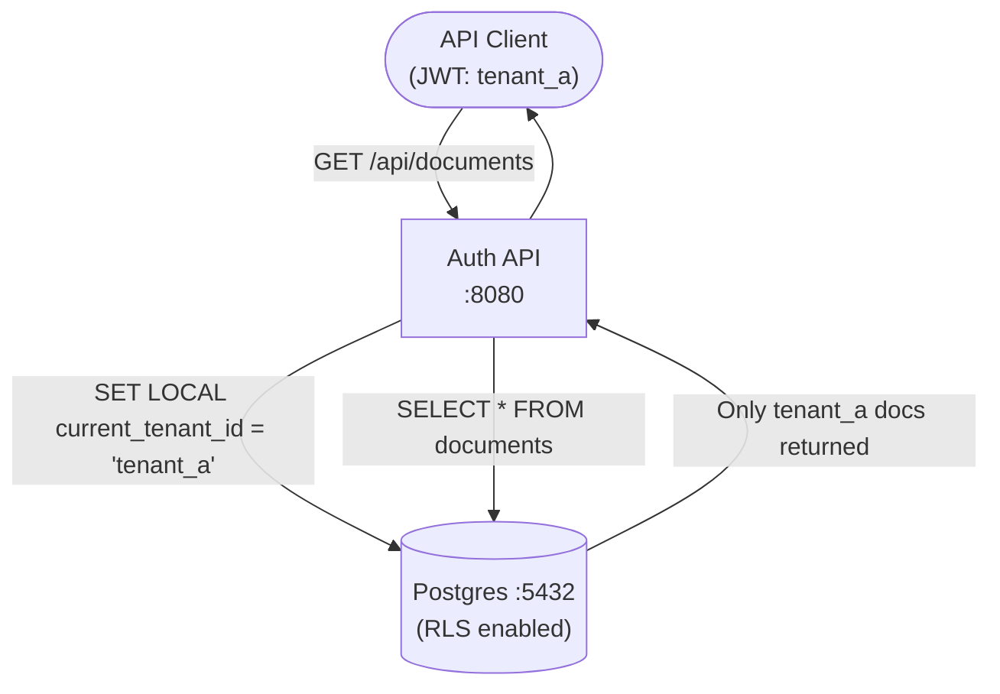

# Architecture — multi-tenant-auth-rbac
> Last updated: 2026-08-29 | Maturity: Partial Prototype
> _Multi-tenant isolation using PostgreSQL RLS._

## System Diagram

## Component Table
| Component | File | Responsibility | Tech |
|---|---|---|---|
| API Server | `src/server.ts` | REST endpoints, JWT validation | Express.js |
| DB Schema | `schema.sql` | RLS definitions and tables | PostgreSQL |

## Dependency Honesty Table
| Dependency | Status | Notes |
|---|---|---|
| PostgreSQL | **Real** | Postgres 16 required to enforce Row-Level Security policies. |
